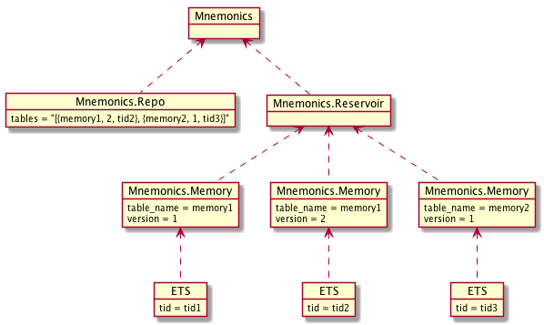

Mnemonics
==
Read only data store for Elixir: fast, concurrently, for large data & hot reloadable.

[](https://hex.pm/packages/mnemonics)
[](https://travis-ci.org/ne-sachirou/mnemonics)

Mnemonics is analogous to Ruby's [ActiveHash](https://rubygems.org/gems/active_hash) in it's usecase.

[Document](https://hex.pm/docs/mnemonics).

Installation
--
Add `mnemonics` to your list of dependencies in `mix.exs`.

```elixir
def deps do
  [
    {:mnemonics, "~> 0.3"}
  ]
end
```

Start under your application.

```elixir
defmodule Your.Application do
  use Application

  def start(_type, _args) do
    children = [
      {Mnemonics, [name: Your.Mnemonics, ets_dir: "/tmp"]}
    ]

    opts = [strategy: :one_for_one, name: Your.Supervisor]
    Supervisor.start_link(children, opts)
  end
end
```

Usage
--
Create an `example.ets` by `:ets.tab2file/3`. Then put it into the ets_dir. The `examples.ets` stores `{:example1, %{id: :example1}}`.

```
priv/
└repo/
  └seeds/
    └examples.ets
```

Create an `Example` module, use Mnemonics & load.

```elixir
defmodule Example do
  use Mnemonics, table_name: :examples, sup_name: Your.Mnemonics
end

Example.load(1)
```

We can lookup the table.

```elixir
:ets.lookup(Example.table_name(1), :example1)
```

Let's reload a new table. Put a new `examples.ets` into the ets_dir & load it with a new version number.

```elixir
Example.load(2)
```

We can lookup the new table.

```elixir
:ets.lookup(Example.table_name(2), :example1)

snap = Mnemonics.Snap.snap(Mnemonics.Snap.new(), 2, %{})
:ets.lookup(Example.table_name(snap), :example1)
```

Mnemonics has cache function named `Mnemonics.Snap`.

```elixir
snap = Mnemonics.Snap.snap(Mnemonics.Snap.new(), 2, %{})
get_and_update_in(snap[:examples].cache[:example1], fn
  nil ->
    example = :ets.lookup Example.table_name(snap), :example1
    {example, example}

  example ->
    {example, example}
end)
```

### :ets.new/2 Option
* Should `:public` or `:protected`. `:protected` (default) is recommended.
* Can't `:named_table`.
* `{:read_concurrency, true}` is recommended.

## Architechture
[](https://github.com/ne-sachirou/mnemonics/blob/master/processes.png)
